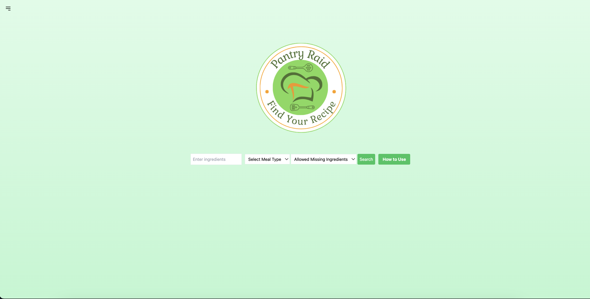

# Pantry Raid

## Screenshot Of Pantry Raid

## Project Background
Pantry Raid was created to address the common dilemma faced by all of us: "What can I cook with the ingredients I already have at home?" In addition to this, there was a growing need to easily access nutritional information to make healthier cooking decisions without the hassle of searching through multiple websites or apps. Pantry Raid aims to simplify meal planning and preparation by offering a streamlined process for finding recipes based on available ingredients and providing immediate access to their nutritional content. Pantry Raid is a web application designed to help users find recipes based on ingredients they have at hand and view detailed nutritional information for each recipe. Pantry Raid utilizes the Spoonacular API for recipe searches and the Nutritionix API for fetching nutritional data, it provides a seamless experience for anyone looking to cook with what they've got in the pantry while keeping nutritional content in mind.

## User Story
 * As a health-conscious individual who often finds themselves with a mix of random ingredients in the pantry.
 * I want to quickly find recipes that I can make with what I have in my pantry.
 * So that I can prepare healthy meals without needing to run to the store or waste food.

## Features
 * Recipe Search: Users can enter ingredients to find matching recipes.
 * Nutritional Information: For each recipe, users can view detailed nutritional information in a modal.
 * Favorites: Users can mark recipes as favorites for easy access later.
 * Responsive Design: Built with Tailwind CSS, the application is fully responsive and provides a smooth experience across different devices.

## Usage
 * Finding Recipes: Enter ingredients in the search form on the homepage and submit to find recipes.
 * Viewing Recipe Details: Click on any recipe title to view its details, including ingredients and preparation steps.
 * Nutritional Information: On the recipe page, click the "Show Nutritional Info" button to open a modal displaying the recipe's nutritional information.

## Technologies Used
 * HTML: The backbone of the project, structuring the web content and layout.
 * CSS and Tailwind CSS: Used for styling, ensuring the application is visually appealing and responsive across devices. Tailwind CSS for development with high customization flexibility.
 * JavaScript: Makes the website interactive and allows it to fetch and show new recipe information automatically without needing to reload the page.
 * Spoonacular API: A food, recipe, and nutritional information API that provides the data for recipe searches based on ingredients.
 * Nutritionix API: Delivers nutritional analysis of food items and recipes.

## Contact
 * Nicole Greenspun - greenspun.nicole@gmail.com
 * Francisco Ortiz - franciscoortz89@gmail.com
 * Daniel Gomez - danny.f.gomez@gmail.com
 * Spencer Klinkowize - sklinkowize7@gmail.com

## Project Link
 * https://github.com/spencerklink/pantry-raid

 ## Deployed Site
 * https://spencerklink.github.io/Pantry-Raid/
 

